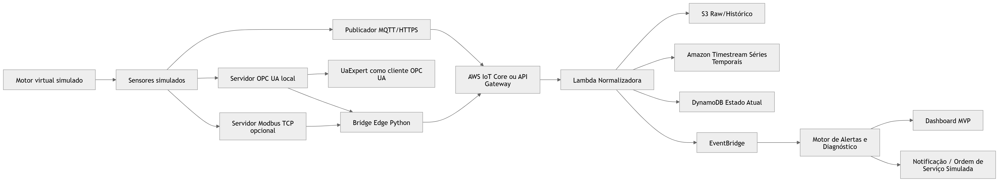

# Condition Monitoring Lab MVP

MVP demonstrativo de monitoramento de condição para ativos industriais, usando uma bancada virtual controlada.

O projeto simula um motor industrial monitorado por sensores virtuais, expõe tags via OPC UA, publica telemetria por MQTT/HTTPS, envia dados para AWS, armazena histórico, calcula tendências, detecta falhas iniciais por regras técnicas e apresenta alertas explicáveis em dashboard.

## Arquitetura



## Objetivo do MVP

Demonstrar para clientes o fluxo completo:

1. Motor virtual funcionando normalmente.
2. UaExpert conectado ao servidor OPC UA local.
3. Tags OPC UA mudando em tempo real.
4. Bridge Edge lendo dados do servidor OPC UA.
5. Bridge publicando dados via MQTT ou HTTPS.
6. AWS recebendo, normalizando e armazenando dados.
7. Dashboard mostrando tendências.
8. Motor de regra detectando falha inicial.
9. Alerta com causa provável, evidências e ação recomendada.

## Fora do escopo

Não faz parte deste MVP:

- Desenvolver máquinas.
- Desenvolver sensores físicos.
- Desenvolver firmware.
- Desenvolver PLC.
- Controlar atuadores industriais.
- Fazer automação de processo.
- Interferir em malhas de controle.

O MVP começa na camada de dados: recebimento, leitura, padronização, tratamento, logging, armazenamento histórico, análise contínua e entrega de diagnóstico.

## Cenários simulados

| Cenário | Comportamento esperado |
|---|---|
| `normal` | RPM estável, temperatura controlada, vibração baixa |
| `lubrication_degradation` | Ultrassom sobe primeiro, depois temperatura e vibração |
| `imbalance` | Vibração RMS cresce de forma contínua |
| `bearing_fault` | Kurtosis e crest factor sobem antes do RMS ficar crítico |

## Stack inicial

### Local / laboratório

- Python 3.11+
- Docker Desktop
- Mosquitto MQTT Broker
- Biblioteca `opcua` para servidor e cliente OPC UA em Python
- `paho-mqtt` para publicação MQTT local
- `PyYAML` para configuração do simulador
- UaExpert como cliente OPC UA de demonstração
- Streamlit ou dashboard web simples para visualização

Nota técnica: a Sprint 2 usa `opcua` como dependência OPC UA. A biblioteca `asyncua` não faz parte do runtime atual.

### AWS

- AWS IoT Core para entrada MQTT
- API Gateway para entrada HTTPS
- Lambda para normalização
- S3 para histórico bruto
- Amazon Timestream para séries temporais
- DynamoDB para estado atual e alertas
- EventBridge para eventos
- SNS ou SES para notificação futura
- CloudWatch para logs

## Decisão de ambiente

| Opção | Uso no MVP | Recomendação |
|---|---:|---|
| Notebook com Docker | Sim | Melhor para primeira demo presencial |
| EC2 na AWS | Sim | Bom para demo remota |
| WAGO Edge Controller | Não no início | Avaliar em fase 2, apenas como host edge industrial |
| PLC | Não | Fora do escopo |

## Como rodar a demonstração local

### Preparar ambiente Python

```powershell
python -m venv .venv
.\.venv\Scripts\Activate.ps1
python -m pip install -e .
Copy-Item .env.example .env
```

### Rodar o simulador OPC UA do Motor_001

```powershell
python -m simulator.opcua_server
```

O servidor expõe as tags em:

```text
opc.tcp://localhost:4840/lab/opcua/
```

No UaExpert, navegue até:

```text
Objects > Lab > Motor_001
```

Tags expostas na primeira versão:

- `rpm`
- `vibration_rms_mm_s`
- `vibration_peak_g`
- `temperature_c`
- `ultrasound_db`
- `horimeter_h`
- `kurtosis`
- `crest_factor`
- `health_score`
- `severity`
- `failure_mode`

### Rodar testes do simulador

```powershell
python -m unittest discover -s tests
```

### Subir Mosquitto local

```powershell
docker info
docker compose up -d mosquitto
docker compose ps
```

O broker usa a configuração de laboratório em `infra/docker/mosquitto.conf`:

```text
listener 1883 0.0.0.0
allow_anonymous true
persistence false
log_type all
```

### Rodar a bridge OPC UA para MQTT

Com o Mosquitto e o simulador OPC UA rodando:

```powershell
python -m edge_bridge.main
```

Por padrão, a bridge lê:

```text
opc.tcp://localhost:4840/lab/opcua/
```

E publica em:

```text
lab/cliente_demo/lab_virtual/motor_001/telemetry
```

Para inspecionar as mensagens:

```powershell
docker exec -it lab-mosquitto mosquitto_sub -h localhost -t "lab/+/+/+/telemetry" -v
```

Variáveis úteis:

| Variável | Padrão |
|---|---|
| `OPCUA_ENDPOINT` | `opc.tcp://localhost:4840/lab/opcua/` |
| `OPCUA_NAMESPACE_INDEX` | `2` |
| `MQTT_HOST` | `localhost` |
| `MQTT_PORT` | `1883` |
| `MQTT_TOPIC` | `lab/cliente_demo/lab_virtual/motor_001/telemetry` |
| `BRIDGE_INTERVAL_SECONDS` | `1.0` |
| `BRIDGE_PUBLISH_MODE` | `mqtt` |
| `HTTPS_INGEST_URL` | vazio |

### Checklist manual da Sprint 2

Com o Docker Desktop aberto, valide o ambiente:

```powershell
docker info
docker compose up -d mosquitto
docker compose ps
```

Depois execute em três terminais:

```powershell
python -m simulator.opcua_server
```

```powershell
python -m edge_bridge.main
```

```powershell
docker exec -it lab-mosquitto mosquitto_sub -h localhost -t "lab/+/+/+/telemetry" -v
```

Critérios de aceite:

- `docker ps` mostra o container `lab-mosquitto` em execução.
- O UaExpert conecta em `opc.tcp://localhost:4840/lab/opcua/`.
- O caminho `Objects > Lab > Motor_001` mostra 11 tags.
- A bridge lê as 11 tags sem encerrar se OPC UA ou MQTT ficarem temporariamente indisponíveis.
- O tópico MQTT recebe payload canônico a cada intervalo configurado.
- `failure_mode_simulated` fica no contexto do payload.
- `metrics` contém apenas métricas numéricas.
- Pelo menos 9 métricas numéricas aparecem no payload.

### Roteiro completo da demo

1. Subir broker MQTT local com Mosquitto.
2. Rodar o simulador do motor e servidor OPC UA.
3. Abrir o UaExpert.
4. Conectar ao endpoint OPC UA:

```text
opc.tcp://localhost:4840/lab/opcua/
```

5. Navegar até:

```text
Objects > Lab > Motor_001
```

6. Arrastar variáveis para a área de monitoramento.
7. Rodar a bridge OPC UA -> MQTT/HTTPS.
8. Validar chegada dos dados na AWS.
9. Abrir o dashboard.
10. Aguardar o ciclo de falha simulada e observar o alerta.

## Sprint 3 - Ingestão AWS via HTTPS

Fluxo-alvo:

```text
Bridge HTTPS
  -> API Gateway
  -> Lambda normalizadora
  -> S3 raw
  -> DynamoDB latest state
  -> Timestream telemetry
  -> EventBridge TelemetryNormalized
```

Variáveis de ambiente da Lambda:

| Variável | Valor inicial |
|---|---|
| `RAW_BUCKET` | `mvp-condition-monitoring-raw` |
| `TIMESTREAM_DB` | `condition_monitoring_lab` |
| `TIMESTREAM_TABLE` | `telemetry` |
| `DYNAMODB_TABLE` | `mvp_asset_state` |
| `EVENT_BUS` | `default` |

Componentes iniciais:

- Lambda normalizadora: `src/aws_lambdas/ingest_lambda.py`
- Testes da Lambda: `tests/test_ingest_lambda.py`
- Scripts e notas AWS CLI: `infra/aws-cli/`

Definition of Done da Sprint 3:

- Lambda valida payload válido.
- Lambda rejeita payload inválido.
- Payload bruto é salvo no S3.
- Métricas são gravadas no Timestream.
- Último estado é atualizado no DynamoDB.
- API Gateway recebe `POST /telemetry`.
- Bridge envia HTTPS usando `HTTPS_INGEST_URL`.
- CloudWatch mostra logs sem erro.

## Status do projeto

Sprint 2: code-ready.

PENDENTE OPERACIONAL:

Validar fluxo real OPC UA -> Bridge -> Mosquitto quando Docker Desktop estiver ativo.

Sprint 3: aberta. Foco atual: ingestão AWS via HTTPS antes de AWS IoT Core MQTT.

