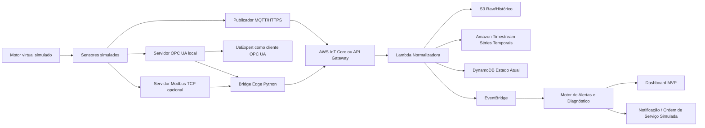

# Visão Geral da Arquitetura

## 1. Propósito

Esta arquitetura define um MVP demonstrativo de monitoramento de condição em ambiente de laboratório controlado.

O sistema simula um ativo industrial, expõe dados por protocolos comuns de integração industrial, envia telemetria para AWS, processa os dados, armazena séries históricas e gera diagnósticos de falha com evidências e recomendações.

## 2. Princípios arquiteturais

1. Começar 100% virtual.
2. Não depender de PLC.
3. Não desenvolver sensores, firmware ou coletores físicos.
4. Simular a aparência industrial por OPC UA.
5. Usar MQTT/HTTPS para integração com nuvem.
6. Separar claramente simulação, ingestão, tratamento, armazenamento, diagnóstico e visualização.
7. Manter baixo custo e baixa complexidade para demo.
8. Permitir evolução posterior para WAGO Edge Controller, AWS IoT SiteWise Edge e modelos de IA.

## 3. Arquitetura lógica



## 4. Componentes

### 4.1 Motor virtual simulado

Responsável por gerar sinais sintéticos de um motor industrial.

Variáveis principais:

- RPM.
- Vibração RMS.
- Pico de vibração.
- Temperatura.
- Ultrassom.
- Horímetro.
- Kurtosis.
- Crest factor.
- Health score.
- Severidade.
- Modo de falha simulado.

### 4.2 Servidor OPC UA local

Responsável por expor as variáveis simuladas em uma árvore OPC UA navegável pelo UaExpert.

Endpoint local:

```text
opc.tcp://localhost:4840/lab/opcua/
```

Estrutura OPC UA:

```text
Objects
└── Lab
    └── Motor_001
        ├── rpm
        ├── vibration_rms_mm_s
        ├── vibration_peak_g
        ├── temperature_c
        ├── ultrasound_db
        ├── horimeter_h
        ├── kurtosis
        ├── crest_factor
        ├── health_score
        ├── severity
        └── failure_mode
```

### 4.3 UaExpert

Ferramenta usada apenas como cliente OPC UA para demonstrar visualmente que existe uma fonte industrial de dados.

O UaExpert não será usado como servidor, nem como parte operacional do backend.

### 4.4 Mosquitto MQTT Broker local

Broker MQTT usado em laboratório para testes locais.

No laboratório será permitida conexão anônima para facilitar a demonstração.

Em ambiente real, a conexão deve usar autenticação, TLS e certificados.

### 4.5 Bridge Edge

Serviço Python responsável por:

- Ler dados do servidor OPC UA.
- Opcionalmente ler dados Modbus TCP.
- Padronizar nomes e unidades.
- Criar payload canônico.
- Publicar via MQTT ou HTTPS.
- Gerar logs locais.
- Controlar retry e falhas temporárias.

### 4.6 AWS IoT Core

Entrada principal para telemetria MQTT.

Responsabilidades no MVP:

- Receber mensagens MQTT.
- Roteá-las para Lambda ou outros serviços por regra.
- Separar tópicos por tenant, planta e ativo.

Tópico sugerido:

```text
lab/{tenant_id}/{plant_id}/{asset_id}/telemetry
```

Exemplo:

```text
lab/cliente_demo/lab_virtual/motor_001/telemetry
```

### 4.7 API Gateway

Entrada alternativa para telemetria HTTPS.

Uso recomendado:

- Testes com fornecedores que entregam dados por REST/Webhook.
- Demo sem MQTT.
- Integrações futuras com sistemas externos.

### 4.8 Lambda Normalizadora

Responsável por receber o payload, validar campos obrigatórios, padronizar dados e gravar nos destinos.

Responsabilidades:

- Validar schema.
- Gerar `event_id`.
- Validar timestamp.
- Padronizar nomes de métricas.
- Gravar payload bruto no S3.
- Escrever séries temporais no Timestream.
- Atualizar estado atual no DynamoDB.
- Publicar evento no EventBridge.
- Gerar logs no CloudWatch.

### 4.9 S3

Armazenamento do histórico bruto e arquivos derivados.

Uso:

- Payloads originais.
- Dados rejeitados.
- Dados enriquecidos.
- Evidências futuras.
- Datasets para treinamento posterior.

Particionamento sugerido:

```text
s3://bucket/raw/tenant={tenant_id}/plant={plant_id}/asset={asset_id}/date={yyyy-mm-dd}/{event_id}.json
s3://bucket/rejected/tenant={tenant_id}/date={yyyy-mm-dd}/{event_id}.json
s3://bucket/features/tenant={tenant_id}/plant={plant_id}/asset={asset_id}/date={yyyy-mm-dd}/features.parquet
```

### 4.10 Amazon Timestream

Banco de séries temporais do MVP.

Uso:

- Consultas por janela temporal.
- Tendências.
- Gráficos de dashboard.
- Cálculo de médias móveis.
- Comparação entre sinais.

### 4.11 DynamoDB

Banco de estado operacional.

Uso:

- Último estado do ativo.
- Último alerta.
- Histórico resumido de alertas.
- Controle de idempotência.
- Consulta rápida do dashboard.

### 4.12 EventBridge

Barramento de eventos internos.

Eventos principais:

- TelemetryNormalized.
- AlertCreated.
- AlertUpdated.
- MaintenanceActionSimulated.

### 4.13 Motor de Alertas e Diagnóstico

Responsável por aplicar regras técnicas e gerar alertas explicáveis.

No MVP, a lógica será baseada em regras e tendências simples.

Exemplo de diagnóstico:

- Causa provável: início de falha de lubrificação.
- Evidência: ultrassom subiu antes da vibração RMS.
- Severidade: warning.
- Ação recomendada: verificar lubrificação e condição do rolamento.

### 4.14 Dashboard MVP

Dashboard para apresentação.

Recomendação para primeira versão:

- Streamlit rodando localmente ou em EC2.

Telas mínimas:

1. Estado atual do ativo.
2. Séries temporais.
3. Modo de falha simulado.
4. Alertas gerados.
5. Evidências e ação recomendada.
6. Status da ingestão.

## 5. Ambientes

### 5.1 Local presencial

- Notebook com Docker.
- Simulador OPC UA local.
- UaExpert instalado.
- Mosquitto local.
- Bridge local.
- Conexão AWS pela internet.

### 5.2 Demo remota

- EC2 com Docker.
- Simulador e bridge rodando na EC2.
- Acesso remoto ao dashboard.
- Opcional: túnel seguro ou VPN para acesso controlado.

## 6. Fase 2

Após validação do MVP:

- Adicionar WAGO Edge Controller como host edge industrial.
- Adicionar Modbus TCP completo.
- Avaliar AWS IoT SiteWise Edge para ingestão OPC UA gerenciada.
- Adicionar SageMaker para modelo de anomalia.
- Adicionar RAG com manuais e POPs.
- Integrar ordens de serviço reais.

