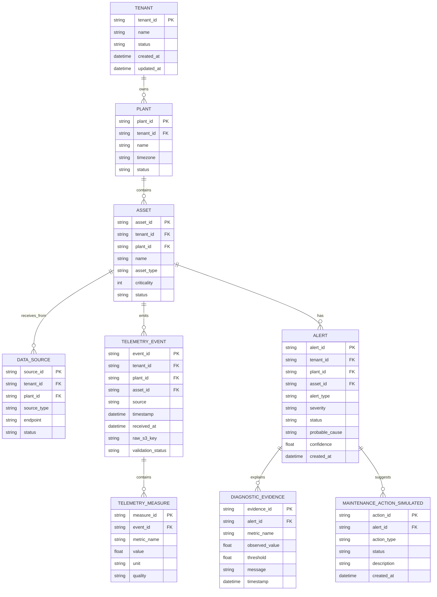

# Entidades e Relacionamentos

## 1. Visão conceitual

O MVP possui entidades de domínio operacional, eventos de telemetria, séries temporais, estado atual e alertas.

Para simplificar o MVP, parte dos dados transacionais pode ficar em DynamoDB. Em uma fase posterior, entidades de domínio como clientes, plantas, ativos, usuários e ordens de serviço podem migrar para Aurora PostgreSQL.

## 2. Diagrama ER conceitual



## 3. Modelagem em DynamoDB para MVP

### 3.1 Tabela: `mvp_asset_state`

Uso: leitura rápida do último estado do ativo.

Chave primária:

| Campo | Tipo | Exemplo |
|---|---|---|
| pk | string | TENANT#cliente_demo#ASSET#motor_001 |
| sk | string | LATEST |

Item exemplo:

```json
{
  "pk": "TENANT#cliente_demo#ASSET#motor_001",
  "sk": "LATEST",
  "tenant_id": "cliente_demo",
  "plant_id": "lab_virtual",
  "asset_id": "motor_001",
  "source": "opcua_lab_simulator",
  "updated_at": "2026-05-22T13:00:00Z",
  "health_score": 82.4,
  "severity_score": 17.6,
  "failure_mode_simulated": "lubrication_degradation",
  "metrics": {
    "rpm": {"value": 1782.4, "unit": "rpm"},
    "vibration_rms_mm_s": {"value": 2.7, "unit": "mm/s"},
    "temperature_c": {"value": 66.1, "unit": "C"},
    "ultrasound_db": {"value": 41.3, "unit": "dB"}
  },
  "raw_s3_key": "raw/tenant=cliente_demo/plant=lab_virtual/asset=motor_001/date=2026-05-22/evt_123.json"
}
```

### 3.2 Tabela: `mvp_alerts`

Uso: alertas ativos e histórico resumido.

Chave primária:

| Campo | Tipo | Exemplo |
|---|---|---|
| pk | string | TENANT#cliente_demo#ASSET#motor_001 |
| sk | string | ALERT#2026-05-22T13:00:00Z#alert_123 |

GSI recomendado:

| Índice | PK | SK | Uso |
|---|---|---|---|
| gsi_status_created | status | created_at | Listar alertas abertos |
| gsi_tenant_severity | tenant_severity | created_at | Listar críticos por tenant |

Item exemplo:

```json
{
  "pk": "TENANT#cliente_demo#ASSET#motor_001",
  "sk": "ALERT#2026-05-22T13:00:00Z#alert_123",
  "alert_id": "alert_123",
  "tenant_id": "cliente_demo",
  "plant_id": "lab_virtual",
  "asset_id": "motor_001",
  "alert_type": "lubrication",
  "severity": "warning",
  "status": "open",
  "probable_cause": "Início de falha de lubrificação",
  "confidence": 0.78,
  "evidence": [
    "Ultrassom acima do baseline",
    "Temperatura em tendência de alta",
    "Vibração ainda abaixo de nível crítico"
  ],
  "recommended_action": "Inspecionar lubrificação e condição do rolamento",
  "created_at": "2026-05-22T13:00:00Z",
  "updated_at": "2026-05-22T13:00:00Z",
  "tenant_severity": "cliente_demo#warning"
}
```

### 3.3 Tabela: `mvp_idempotency`

Uso: evitar duplicação de eventos.

Chave primária:

| Campo | Tipo | Exemplo |
|---|---|---|
| event_id | string | evt_123 |

Atributos:

- tenant_id.
- asset_id.
- first_seen_at.
- ttl.

## 4. Modelagem em Timestream

### 4.1 Database

```text
condition_monitoring_lab
```

### 4.2 Table

```text
telemetry
```

### 4.3 Dimensions

| Dimension | Exemplo | Descrição |
|---|---|---|
| tenant_id | cliente_demo | Cliente |
| plant_id | lab_virtual | Planta ou ambiente |
| asset_id | motor_001 | Ativo |
| source | opcua_lab_simulator | Fonte |
| unit | mm/s | Unidade |

### 4.4 Measures

| MeasureName | MeasureValueType |
|---|---|
| rpm | DOUBLE |
| vibration_rms_mm_s | DOUBLE |
| vibration_peak_g | DOUBLE |
| temperature_c | DOUBLE |
| ultrasound_db | DOUBLE |
| horimeter_h | DOUBLE |
| kurtosis | DOUBLE |
| crest_factor | DOUBLE |
| health_score | DOUBLE |
| severity | DOUBLE |

## 5. Modelagem em S3

### 5.1 Buckets sugeridos

```text
mvp-condition-monitoring-raw-{account}-{region}
mvp-condition-monitoring-artifacts-{account}-{region}
```

### 5.2 Prefixos

```text
raw/tenant={tenant_id}/plant={plant_id}/asset={asset_id}/date={yyyy-mm-dd}/{event_id}.json
rejected/tenant={tenant_id}/date={yyyy-mm-dd}/{event_id}.json
features/tenant={tenant_id}/plant={plant_id}/asset={asset_id}/date={yyyy-mm-dd}/features.parquet
exports/tenant={tenant_id}/date={yyyy-mm-dd}/
```

## 6. Observação sobre Aurora PostgreSQL

Aurora PostgreSQL não é obrigatório no primeiro MVP.

Adicionar Aurora quando o projeto exigir:

- Gestão transacional robusta de usuários.
- Hierarquia complexa de ativos.
- Ordens de serviço reais.
- Permissões por perfil.
- Relatórios executivos persistentes.
- Integrações com ERP/CMMS.

