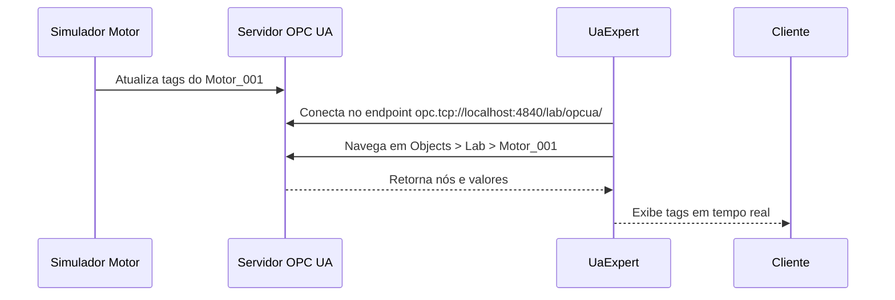
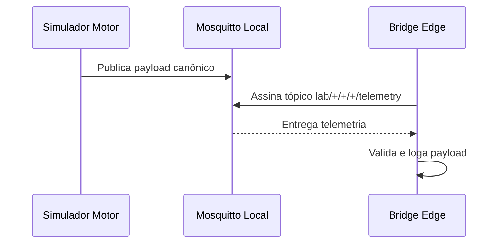
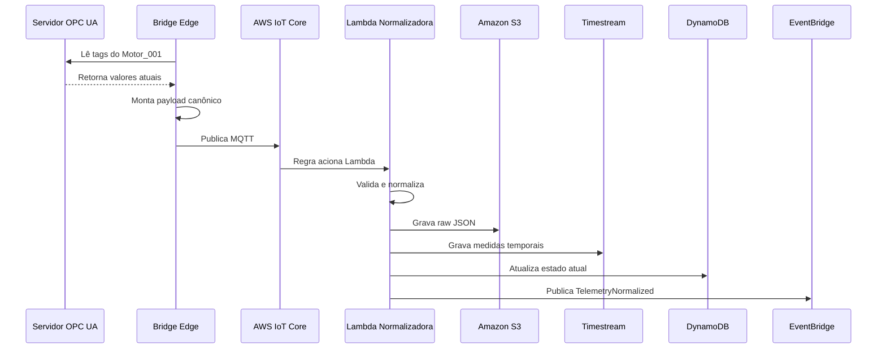
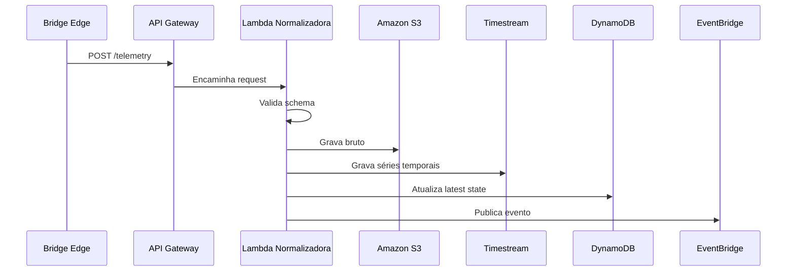
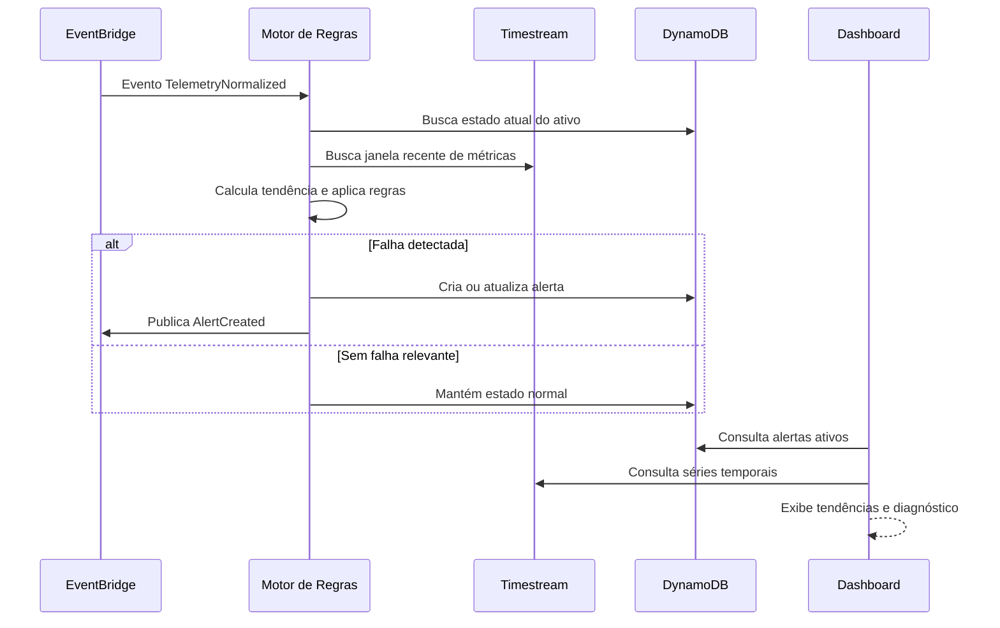

# Fluxos de Integração

## 1. Fluxo local OPC UA para UaExpert



## 2. Fluxo local MQTT



## 3. Fluxo OPC UA para AWS via Bridge



## 4. Fluxo HTTPS para AWS



### 4.1 Fluxo cliente para envio HTTPS

Para implantação em campo, o caminho recomendado é:

```text
Sensor / transmissor / instrumento
  -> switch, gateway ou rede industrial local
  -> Raspberry Pi ou computador edge do cliente
  -> Bridge Sentinela
  -> HTTPS /condition/ingest
  -> Sistema Sentinela na AWS
```

Use o passo a passo em
`docs/manual_cliente_envio_https_sentinela.md` para configurar o lado cliente,
incluindo rede, token, arquivo de campo, simulação de payload, envio real por
HTTPS e serviço Linux.

## 5. Fluxo de diagnóstico



## 6. Payload de entrada MQTT/HTTPS

```json
{
  "tenant_id": "cliente_demo",
  "plant_id": "lab_virtual",
  "asset_id": "motor_001",
  "source": "opcua_lab_simulator",
  "timestamp": "2026-05-22T13:00:00Z",
  "failure_mode_simulated": "lubrication_degradation",
  "metrics": [
    {"name": "rpm", "value": 1781.5, "unit": "rpm"},
    {"name": "vibration_rms_mm_s", "value": 2.8, "unit": "mm/s"},
    {"name": "temperature_c", "value": 66.5, "unit": "C"},
    {"name": "ultrasound_db", "value": 41.2, "unit": "dB"},
    {"name": "kurtosis", "value": 3.4, "unit": "index"},
    {"name": "crest_factor", "value": 3.2, "unit": "index"}
  ]
}
```

## 7. Payload de alerta

```json
{
  "alert_id": "alert_123",
  "tenant_id": "cliente_demo",
  "plant_id": "lab_virtual",
  "asset_id": "motor_001",
  "alert_type": "lubrication",
  "severity": "warning",
  "status": "open",
  "probable_cause": "Início de falha de lubrificação",
  "confidence": 0.78,
  "evidence": [
    "Ultrassom acima do baseline",
    "Temperatura em tendência de alta",
    "Vibração ainda abaixo de nível crítico"
  ],
  "recommended_action": "Inspecionar lubrificação e condição do rolamento",
  "created_at": "2026-05-22T13:00:00Z"
}
```

## 8. Estratégia de tópicos MQTT

### 8.1 Laboratório local

```text
lab/{tenant_id}/{plant_id}/{asset_id}/telemetry
lab/{tenant_id}/{plant_id}/{asset_id}/status
lab/{tenant_id}/{plant_id}/{asset_id}/alerts
```

### 8.2 AWS IoT Core

```text
condition-monitoring/{tenant_id}/{plant_id}/{asset_id}/telemetry
condition-monitoring/{tenant_id}/{plant_id}/{asset_id}/status
```

## 9. Regras de retry

A bridge deve:

1. Tentar enviar evento.
2. Registrar erro em log local quando falhar.
3. Repetir com backoff exponencial.
4. Manter buffer local simples em arquivo ou SQLite na fase futura.
5. Nunca descartar dado sem log.

## 10. Tratamento de erro

| Erro | Ação |
|---|---|
| OPC UA indisponível | Logar, tentar reconectar e manter serviço ativo |
| MQTT indisponível | Repetir envio com backoff |
| API HTTPS retorna 4xx | Registrar payload rejeitado |
| API HTTPS retorna 5xx | Repetir envio |
| Payload inválido | Enviar para área rejected no S3 |
| Falha Timestream | Logar erro e acionar DLQ em fase posterior |

