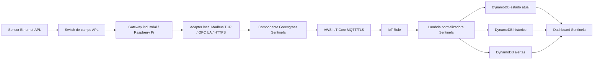

# Ethernet-APL, AWS IoT Greengrass e Sentinela Industrial

## Resumo executivo

O Sentinela Industrial esta bem preparado para receber telemetria industrial ja
normalizada por HTTPS. Para uma arquitetura Ethernet-APL com AWS IoT Core como
broker MQTT principal, a plataforma esta parcialmente pronta: o modelo de dados,
o cadastro de ativos/sensores/gateway, o endpoint `/condition/ingest`, a
persistencia em DynamoDB e as telas de operador/tecnico/admin ja existem. A
lacuna estava no pacote de campo Greengrass e no fluxo MQTT/TLS com certificado
X.509 por gateway.

Esta entrega cria a base desse pacote.

## Maturidade atual

| Camada | Situacao | Observacao |
|---|---|---|
| Cadastro de cliente/planta/contrato | Pronto para piloto | Admin Sentinela controla contrato e modulos. |
| Cadastro de ativo/sensor/gateway | Pronto para indoor assistido | Modelo multifabricante parametrizavel. |
| HTTPS `/condition/ingest` | Operacional | Ja grava estado atual, historico e alertas. |
| Validacao contra cadastro | Parcial | Ainda deve evoluir de aviso para bloqueio em producao plena. |
| Historico e alertas | Operacional em DynamoDB | Timestream e opcional/pendente conforme conta AWS. |
| Ethernet-APL direto | Parcial | Requer adapter local por fabricante/protocolo. |
| AWS IoT Core MQTT/TLS | Base criada nesta entrega | Faltava componente Greengrass e templates IoT. |
| Greengrass no gateway | Base criada nesta entrega | Falta teste em hardware real. |
| Regras IoT para storage | Templates criados | Recomendada regra para Lambda normalizadora. |
| Observabilidade edge | Parcial | Falta dashboard de logs Greengrass/heartbeat do componente. |

## Arquitetura recomendada

## Decisao tecnica

Para producao indoor, usar dois caminhos em paralelo:

1. **Caminho principal novo:** Greengrass publica MQTT/TLS no AWS IoT Core.
2. **Fallback operacional:** bridge HTTPS existente envia para
   `https://sentinelaindustrial.com.br/condition/ingest`.

Isso reduz risco no cliente: se a regra IoT/Lambda ainda estiver em ajuste, o
Sentinela continua recebendo dados pelo HTTPS ja testado.

## O que o gateway precisa fazer

O gateway no cliente deve:

1. Enxergar a rede Ethernet-APL via switch APL/trunk/spur.
2. Ler as variaveis dos instrumentos por protocolo disponivel: Modbus TCP,
   OPC UA, PROFINET, web server HTTPS ou SDK do fabricante.
3. Expor localmente JSON normalizado para o componente Sentinela, por exemplo:
   `http://127.0.0.1:8080/apl/read`.
4. Rodar AWS IoT Greengrass Core com certificado X.509 unico.
5. Publicar cada payload no topico:
   `sentinela/{tenant_id}/{plant_id}/{asset_id}/telemetry`.
6. Manter fila local simples para nao perder payload em falhas temporarias.

## Pacotes criados

| Item | Caminho |
|---|---|
| Publicador Greengrass MQTT | `src/edge/condition_bridge_field/greengrass_iot_publisher.py` |
| Gerador de topico IoT | `src/edge/condition_bridge_field/iot_topic.py` |
| Config Ethernet-APL exemplo | `config/ethernet_apl_greengrass_condition_config.example.json` |
| Sample de leitura APL | `src/edge/condition_bridge_field/sample_ethernet_apl_response.json` |
| Receita Greengrass | `deploy/greengrass/sentinela-condition-apl/recipe.yaml` |
| Provisionamento IoT Core | `deploy/greengrass/scripts/provision_iot_core_gateway.sh` |
| Instalador do core device | `deploy/greengrass/scripts/install_core_device.sh` |
| Gerador do ZIP do componente | `deploy/greengrass/scripts/build_component_package.ps1` |
| Templates IoT Policy/Rules | `deploy/greengrass/templates/` |

## Sequencia recomendada para o cliente real

1. Admin Sentinela cadastra cliente, planta, contrato, gateway e ativos.
2. Sentinela define `tenant_id`, `plant_id`, `asset_id` e mapa de sinais.
3. No console/AWS CLI, Sentinela cria thing, certificado X.509, policy e role
   alias com `provision_iot_core_gateway.sh`.
4. Tecnico instala Greengrass no gateway com `install_core_device.sh`.
5. Tecnico configura adapter local Ethernet-APL.
6. Tecnico testa JSON local do adapter.
7. Sentinela publica componente Greengrass e cria deploy para o thing group.
8. AWS IoT Core recebe MQTT.
9. IoT Rule encaminha para Lambda normalizadora ou DynamoDB raw.
10. Admin Sentinela valida ultimo payload, idade da comunicacao e alertas.
11. Cliente tecnico valida telas de diagnostico.
12. Operador valida tela simplificada de prioridade/alerta.

## Pontos que ainda faltam para producao plena

- Lambda normalizadora dedicada para mensagens do AWS IoT Core usando o mesmo
  contrato de `/condition/ingest`.
- Regra IoT definitiva ligada a essa Lambda em ambiente `prod`.
- Tabela raw de auditoria ou S3 raw para payloads MQTT recebidos.
- Dashboard Admin Sentinela para status do Greengrass: online/offline,
  componente em execucao, ultima publicacao, ultima falha.
- Politicas IoT por tenant/planta mais restritivas que `sentinela/*`.
- Rotacao/revogacao de certificados X.509 por gateway.
- Procedimento HSM/TPM para chave privada em gateways industriais definitivos.
- Teste de firewall do cliente: saida 443 para endpoints AWS IoT e S3.

## Criterio de prontidao indoor

Estamos prontos para um piloto indoor assistido se:

- O gateway Linux acessa a rede Ethernet-APL.
- O adapter local entrega JSON com pelo menos uma metrica valida.
- O thing aparece como Greengrass core device na AWS.
- O componente publica no topico MQTT esperado.
- A regra IoT registra payload em Lambda/DynamoDB raw.
- O Sentinela mostra ultimo estado e alerta de teste.

Nao estamos ainda em producao plena multi-cliente via Greengrass enquanto a
normalizacao MQTT -> DynamoDB/historico/alertas nao estiver automatizada no
mesmo nivel do endpoint HTTPS.

## Referencias oficiais consultadas

- AWS IoT Greengrass V2: instalacao manual com certificados e `--init-config`.
- AWS IoT Core Rules: regras para rotear mensagens MQTT para servicos AWS.
